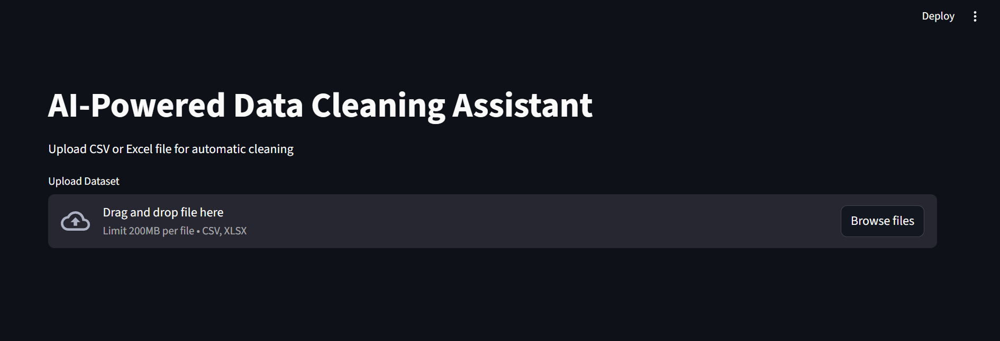
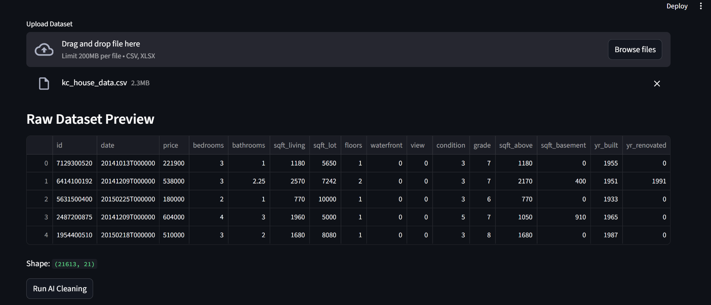
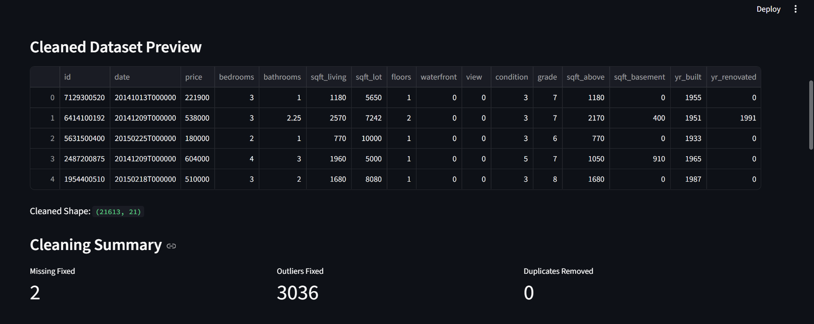
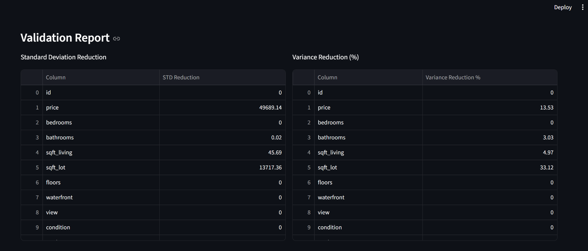
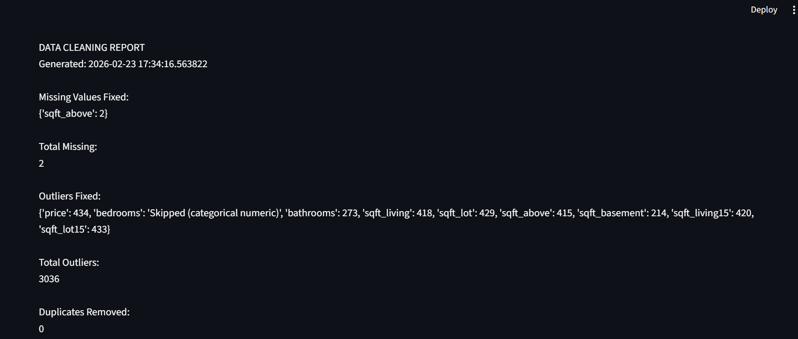
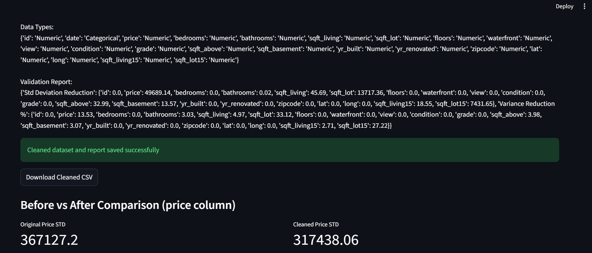

# AI-Powered Data Cleaning Assistant

An intelligent data cleaning system built using Python and Streamlit that automatically detects and resolves common data quality issues such as missing values, outliers, duplicates, and incorrect data types.

---

## Features

- Missing value detection and imputation
- Outlier detection using percentile capping
- Duplicate record removal
- Data type correction
- Validation report with statistical improvement metrics
- Interactive Streamlit UI
- Download cleaned dataset
- Modular and scalable architecture

---

## System Architecture

---

## Project Structure

ai-data-cleaning-assistant/
│
├── app.py
├── requirements.txt
├── README.md
│
├── src/
│ ├── cleaning_pipeline.py
│ ├── data_loader.py
│ ├── datatype_handler.py
│ ├── duplicate_handler.py
│ ├── missing_handler.py
│ ├── outlier_handler.py
│ ├── report_generator.py
│
├── data/
├── reports/
└── screenshots/

---

## Installation

### Step 1: Clone repository

### Step 2: Navigate to folder
cd ai-data-cleaning-assistant

### Step 3: Install dependencies
pip install -r requirements.txt

---

## Run Application
streamlit run app.py

---

## Usage

1. Upload CSV or Excel dataset
2. Click "Run AI Cleaning"
3. View cleaning summary and validation report
4. Download cleaned dataset

---

## Results Example

| Metric | Before | After | Improvement |
|------|--------|--------|-------------|
| Price STD | 367127 | 317438 | 13.53% reduction |
| Missing Values | 2 | 0 | 100% fixed |

---

## Technologies Used

- Python
- Pandas
- NumPy
- Streamlit
- VS Code

---

## Enterprise Use Cases

- Machine learning preprocessing
- Data engineering pipelines
- AIOps log preprocessing
- Business analytics

---

## Application Screenshots

### 1. Upload Dataset Screen

### 2. Raw Dataset Preview

### 3. Cleaned Dataset Preview

### 4. Cleaning Summary

### 5. Validation Report

### 6. Detailed report

## Author

**Ritik Sharma**  
**Software Engineer**  

---

## GitHub Repository

https://github.com/Ritiksharma-06/ai-data-cleaning-assistant
